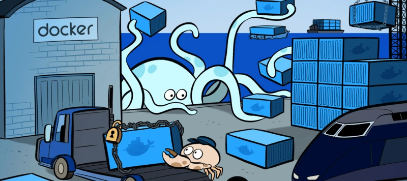

# Docker安装

Mac：https://docs.docker.com/docke...
Windows:https://docs.docker.com/docke...
linux:官网有不同版本的安装的教程
ubuntu:https://docs.docker.com/engin...

# Docker三个基本概念

下面这张图非常的经典，很形象地展示了，什么是容器，什么是镜像，什么是仓库，以及三者之间的联系。



接下来我们来解释一下这张图。现在我们要造一间厨房，在造之前我们首先要干的一件事，就是先列举出我们造厨房需要的东西。我们可能需要一个通了水电煤的房子以及一些必需的厨房用具诸如锅碗瓢勺、煤气灶、冰箱、水槽等等这些东西。现在我们知道需要了什么东西之后，我们就去找这些东西。首先我们先去京东购买一些厨房用具，这些用具就好比我们的Docker镜像，我们厨房的用具到了之后得找个地方把它们放在，不可能随处丢吧，不然后面用的时候就找不到它了，那么我们Docker镜像也是这样，需要一个Docker仓库去存储这些镜像。现在我们有了这些厨房用具之后就可以做饭了吗？答案当然是不能，没水没电没火啊！这时候我们得把厨房用具给装到一个通了水电煤的房子才行，那么Docker镜像也是这样，单纯的Docker镜像是不能用的，它得装到Docker容器中通了水电煤才能使用。等我们装好了厨房用具之后我们就可以开始做饭，那么我们的Docker镜像装到Docker容器之后，我们应用就可以跑起来了。

# Docker常用命令

1.杀死所有正在运行的容器
```
docker kill $(docker ps -a -q)
```
2.删除所有已经停止的容器
```
docker rm $(docker ps -a -q)
```
3.删除所有镜像
```
docker rmi $(docker images -q)
```
4.关闭容器
```
docker stop CONTAINER ID或者NAMES
```
5.重新启动关闭的容器
```
docker start CONTAINER ID或者NAMES
```
6.移除本地容器
```
docker rm CONTAINER ID或者NAMES
```
7.查看本地容器
```
docker ps  //查看正在运行的容器
docker ps -a //查看所有容器
```
8.查看本地镜像
```
docker images
```
9.创建镜像
```
docker build -t name:tag Dockerfile路径
```
10.修改本地镜像标记
```
 docker tag  IMAGE ID  name:tag 
 docker rmi name:tag
 ```
11.删除本地镜像
```
docker rmi name:tag或者IMAGE ID
```
12.进入容器
```
docker exec -it IMAGE ID或者NAMES /bin/bash
```
13.获取镜像中心的镜像
```
docker pull name:tag
```
14.获取容器的端口映射配置
```
docker port CONTAINER ID或者NAMES
```